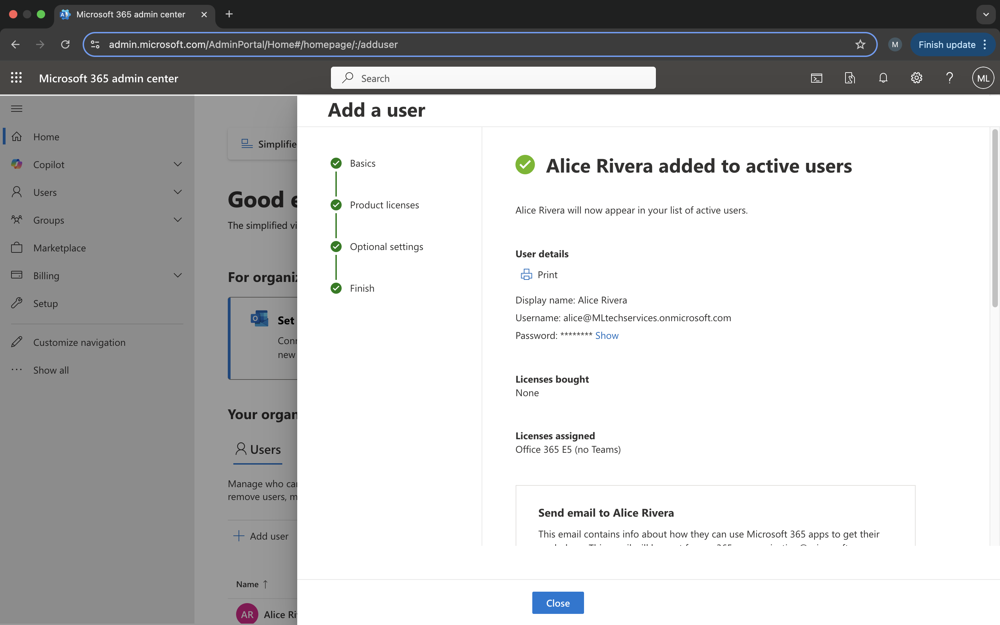
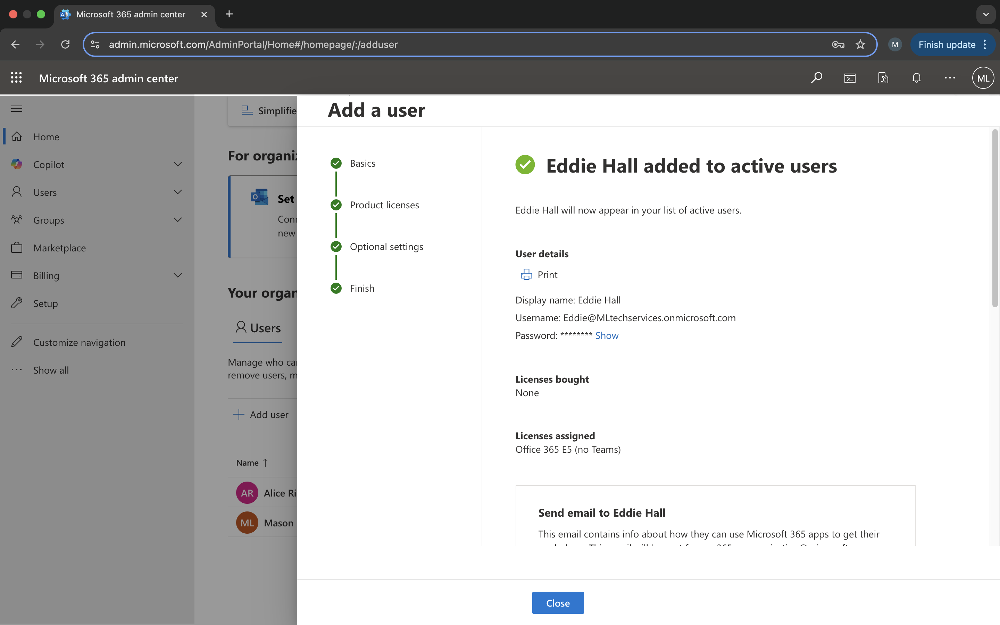
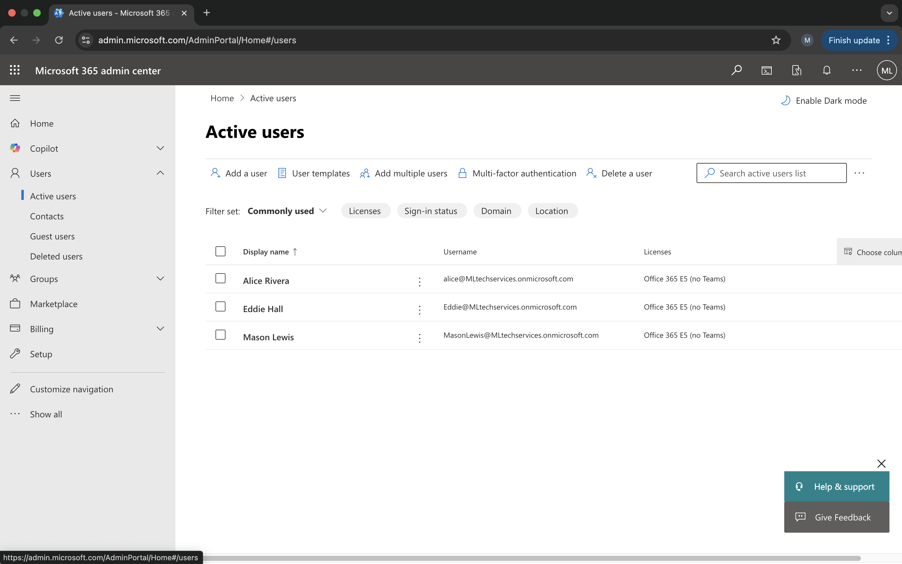
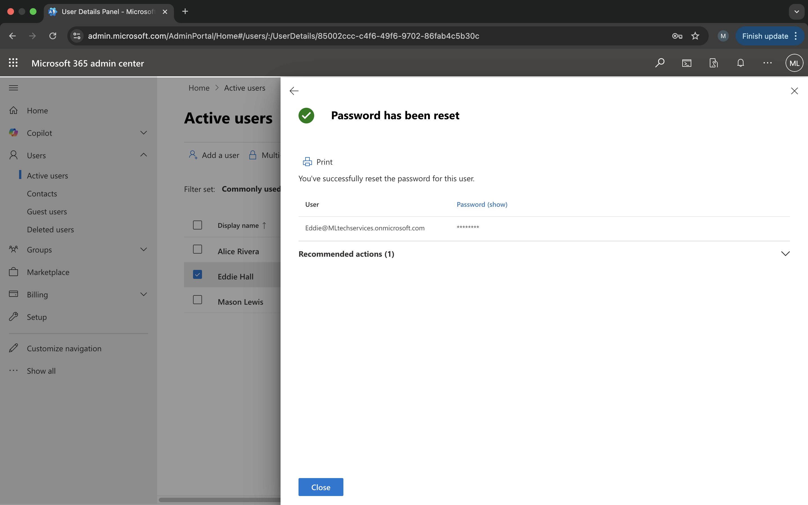
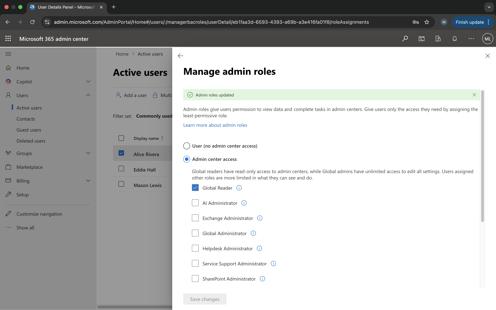
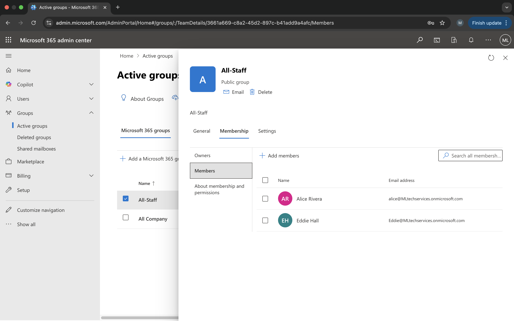
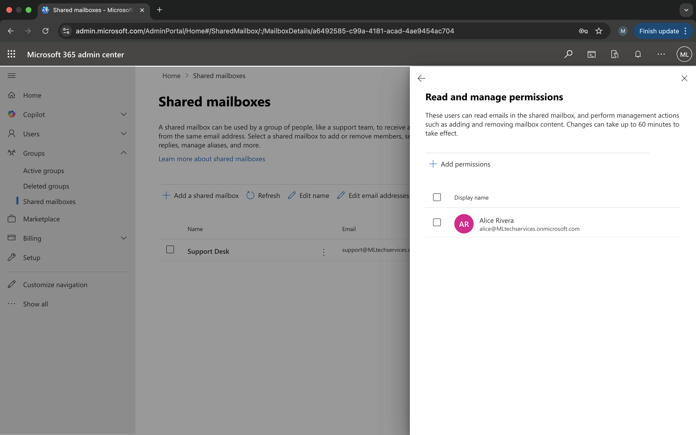
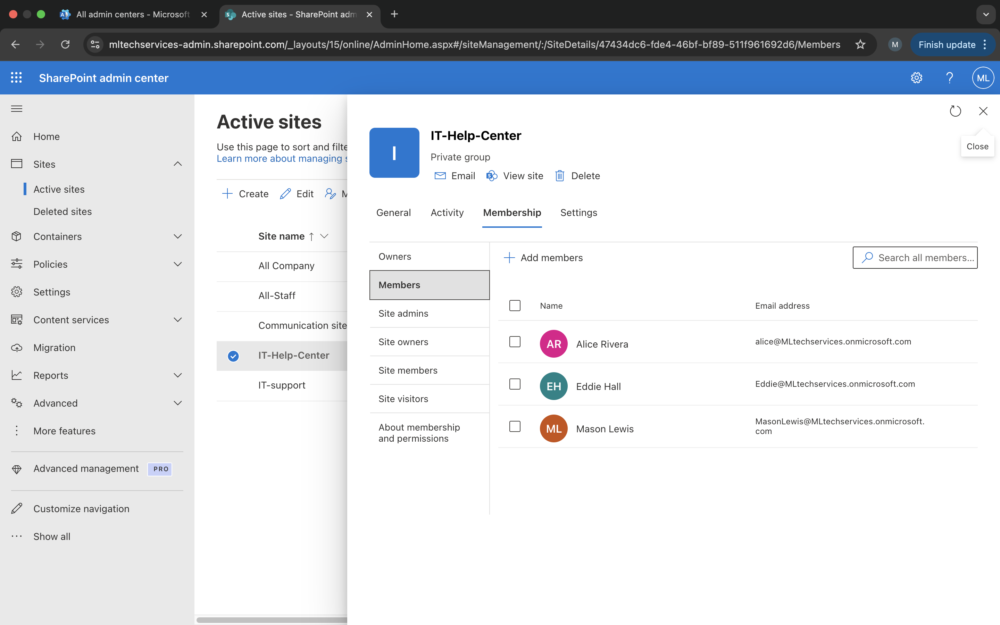
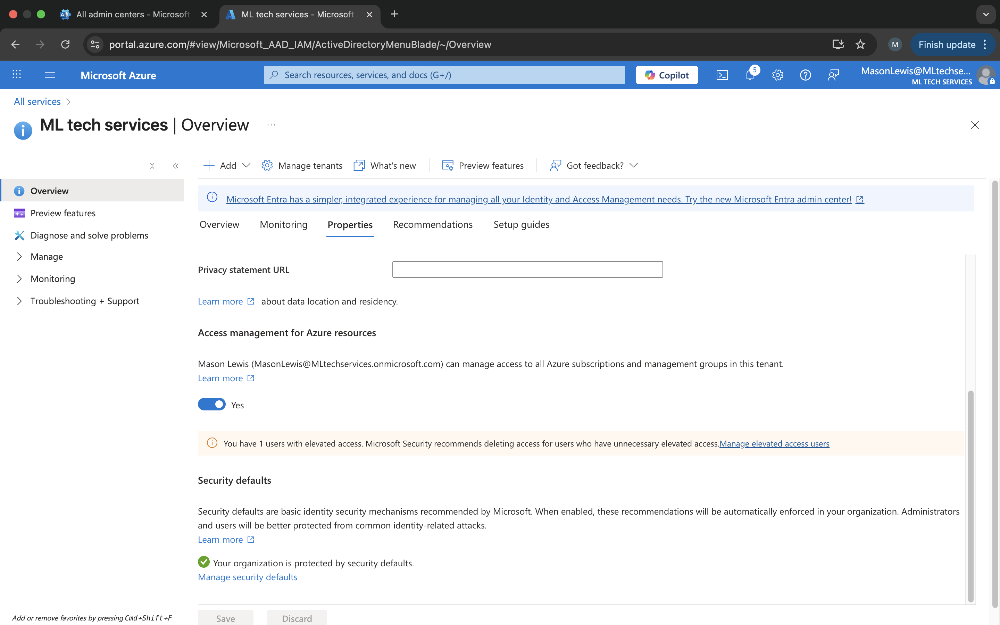
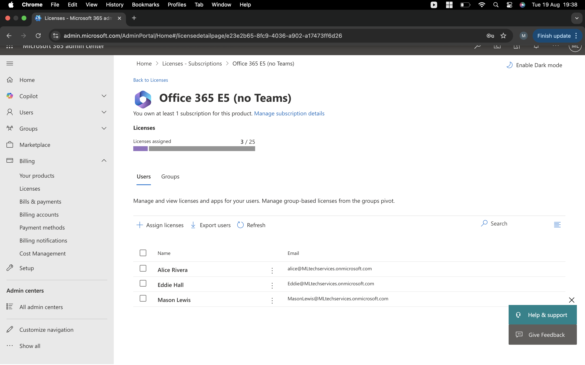

# Microsoft 365 Admin Lab  
This lab demonstrates core Microsoft 365 administration skills, including user management, groups, licensing, and security settings. 

I built a small Microsoft 365 environment for my test company **ML Tech Services** to practice real IT admin tasks.  
This included adding users, resetting passwords, creating groups, assigning roles, and checking licenses.  

The aim was to get hands-on with Microsoft 365 so I can apply these skills in an IT support role.  

---

## ✅ What I Did
- Created two test users (**Alice Rivera** and **Eddie Hall**)  
- Practiced password resets (Eddie)  
- Made groups for collaboration (**All Staff**) and permissions (**IT-Support**)  
- Gave Alice the **Global Reader** admin role (least privilege example)
- Created and delegated permissions for a **Shared Mailbox**  
- Configured **SharePoint site permissions**  
- Checked security defaults and license assignments
- Documented the entire process with screenshots
- ---

## 📸 Screenshots

### User Management
  
  
  
  

### Roles & Groups
  
  
  

### Shared Mailbox & Permissions
  
  

### Security & Licenses
  
  

---

## 📝 Key Takeaways
Doing this lab showed me how Microsoft 365 admin works in practice, beyond just theory.  
I now understand:  
- User lifecycle management  
- Groups and permissions  
- Role-based access control  
- Security defaults and licensing  

---

## 🚀 Why This Matters
These are the exact day-to-day skills expected of an **IT Support Technician** or **Junior Cloud Admin**.  
By documenting this lab on GitHub, I’m building a portfolio that shows employers I can already work with Microsoft 365 in a professional setting.  

